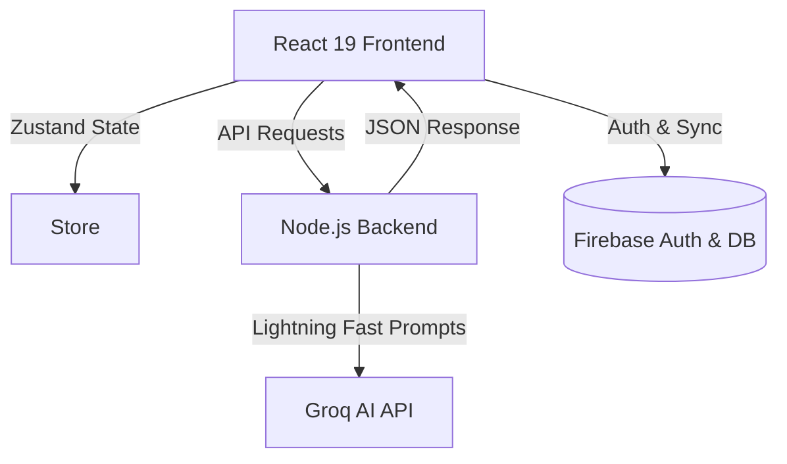

<div align="center">


<h1 align="center" style="font-weight: 300; letter-spacing: 4px;">
  <br/>
  V E L O R A &nbsp;&nbsp; A I
  <br/>
</h1>

<p align="center">
  <i style="font-size: 1.2em; color: #E2B53E;">The Genesis of Intelligent Commerce.</i>
</p>

<p align="center" style="max-width: 600px; margin: 0 auto; color: #888;">
  Velora AI is an ultra-premium, AI-native digital boutique. Built for the discerning shopper, it discards traditional search bars in favor of a <b>lightning-fast, conversational concierge</b> powered by Groq’s LPU Inference Engine. Experience shopping as a curated dialogue.
</p>

<br/>

<p align="center">
  <a href="#-core-features"><strong>Explore Features</strong></a> &nbsp;•&nbsp;
  <a href="https://velora-ai.vercel.app/"><strong>Live Experience</strong></a> &nbsp;•&nbsp;
  <a href="#-performance--speed"><strong>Groq Architecture</strong></a>
</p>

<div align="center">
  <br/>
  <a href="https://react.dev"></a>
  <a href="https://tailwindcss.com"></a>
  <a href="https://groq.com/"></a>
  <a href="https://firebase.google.com/"></a>
  <br/><br/>
</div>

<hr style="border: 1px solid #E2B53E; margin: 40px 0; opacity: 0.3;" />

</div>

<br/>

## 🌌 The Vision

Traditional online shopping is broken. You spend hours reading fake reviews, comparing meaningless specifications, and scrolling through endless pages of irrelevant products. 

**Velora AI** is a paradigm shift. We’ve built an ultra-premium, AI-native shopping consultant that acts as your personal concierge. You don't search; you *converse*. Powered by **Groq's LPU™ Inference Engine**, Velora parses your exact intent, budget, and aesthetic preferences to curate the perfect products in milliseconds. 

<br/>

## ⚡ Performance & Speed

By utilizing **Groq AI**, Velora achieves unprecedented responsiveness. 
Traditional LLM integrations leave users staring at loading spinners while they wait for shopping recommendations. With Groq's deterministic Tensor Streaming Architecture, Velora delivers rich, context-aware product recommendations and synthesized pros/cons at **over 800 tokens per second**. The shopping experience feels instantaneous, fluid, and magical.

<br/>

## ✨ Core Features

<details open>
<summary><b>💬 Conversational AI Concierge</b></summary>
<br/>
Forget keyword searches. Just type exactly what you want: 
<br/><br/>
<kbd> "Find me a great espresso machine under $500 for a beginner, but it needs to look good in a minimalist kitchen."</kbd>
<br/><br/>
Velora understands the context and instantly builds a customized UI carousel of perfect matches right inside the chat window.
</details>

<details open>
<summary><b>👁️ Multimodal Visual Search</b></summary>
<br/>
See a gadget you like on social media? Just upload a screenshot. Velora uses advanced multimodal vision processing to analyze the image, identify the product, and recommend exactly what you're looking for.
</details>

<details open>
<summary><b>⚖️ Intelligent Comparison Matrix</b></summary>
<br/>
Select multiple products and let Velora do the heavy lifting. Our AI dynamically generates:
<ul>
  <li>🏆 <b>Categorized Verdicts:</b> (Best Overall, Best Budget, Premium Pick)</li>
  <li>✅ <b>Pros & Cons:</b> Synthesized from thousands of data points and user reviews.</li>
  <li>📊 <b>Grouped Specifications:</b> Tech specs elegantly categorized for easy reading (Display, Performance, Battery, etc.).</li>
</ul>
</details>

<details open>
<summary><b>🎯 Smart User Dashboard</b></summary>
<br/>
Every user gets a personalized dashboard featuring:
<ul>
  <li><b>Saved Wishlists:</b> Instantly access products you've bookmarked.</li>
  <li><b>Conversation History:</b> Pick up your shopping consultation right where you left off.</li>
  <li><b>Smart Recommendations:</b> AI-driven suggestions based on your recent activity.</li>
</ul>
</details>

<br/>

## 🎨 Ultra-Premium UI/UX

Velora AI is designed to look and feel like a luxury digital experience:
* **Glassmorphism & Neon Highlights:** Deep dark mode with vibrant, context-aware glowing accents.
* **Framer Motion Micro-interactions:** Every button press, modal open, and page transition is governed by smooth spring physics.
* **Component-Driven Design:** A highly modular, easily scalable React architecture ensuring a responsive layout across mobile and desktop.
* **Dynamic Highlight Grids:** Complex technical data is automatically transformed into beautiful, icon-rich highlight cards.

---

## 🛠️ Key Workflows

### The Buyer's Journey
1. **Authentication:** The user securely logs in via Firebase (Google/Email).
2. **Consultation:** The user opens the Chat interface and describes their needs in natural language.
3. **Inference (Groq):** The Express backend securely forwards the prompt to Groq. The model retrieves context from the product database and streams back a structured response.
4. **Rendering:** The React frontend intercepts product IDs within the AI response and dynamically renders rich interactive `ProductCard` components inline with the text.
5. **Evaluation:** The user adds top choices to their Comparison Matrix to view AI-generated pros/cons.

---

## 🏗️ Architecture

Velora uses a modern, lightweight, but immensely powerful tech stack optimized for speed and DX (Developer Experience):



---

## 🚀 Quick Start (Run Locally)

Get your own lightning-fast personal AI shopper running in less than 2 minutes.

### 1. Prerequisites
* **Node.js** (v18+)
* **Groq API Key** ([Get it for free at GroqCloud](https://console.groq.com/))
* **Firebase Project** (Configured for web authentication)

### 2. Setup

```bash
# Clone the repository
git clone https://github.com/kanith8206/Velora-ai.git

# Navigate to the directory
cd velora-ai

# Install dependencies
npm install
```

### 3. Environment Variables
Create a `.env` file in the root folder and add your secret keys. Make sure to include your Groq API key:
```env
GROQ_API_KEY=your_groq_api_key_here
```

### 4. Ignite 🔥
Run the magic command to start both the Vite frontend and Express backend simultaneously:
```bash
npm run dev
```
Open **`http://localhost:3000`** in your browser and experience instant AI shopping!

---

## 💡 Use Cases & Applications

Velora AI isn't just a prototype; it's a blueprint for the future of various industries:
* **High-End Retail:** Luxury brands can offer hyper-personalized 1-on-1 digital consultations.
* **Complex Electronics:** Demystify technical jargon by letting AI explain specs to everyday consumers.
* **Automotive Sales:** Help buyers compare trims, features, and pricing through natural dialogue.
* **B2B Procurement:** Streamline bulk ordering and vendor comparisons via conversational interfaces.

---

## 🤝 Contributing

We welcome contributions from the open-source community to make Velora AI even better. 

1. Fork the repository
2. Create your feature branch (`git checkout -b feature/AmazingFeature`)
3. Commit your changes (`git commit -m 'Add some AmazingFeature'`)
4. Push to the branch (`git push origin feature/AmazingFeature`)
5. Open a Pull Request

---

## 📝 License

Distributed under the MIT License. See `LICENSE` for more information. This means you are free to use, modify, and distribute the code for both commercial and non-commercial purposes.

---

## 📬 Contact & Support

If you have any questions, encounter issues, or want to discuss enterprise implementations, please open an issue in this repository.

<br/>

<div align="center">
  <br/>
  <i>Crafted with passion for the future of e-commerce.</i>
  <br/><br/>
  <b>If you found this project inspiring, please consider leaving a ⭐️</b>
</div>
