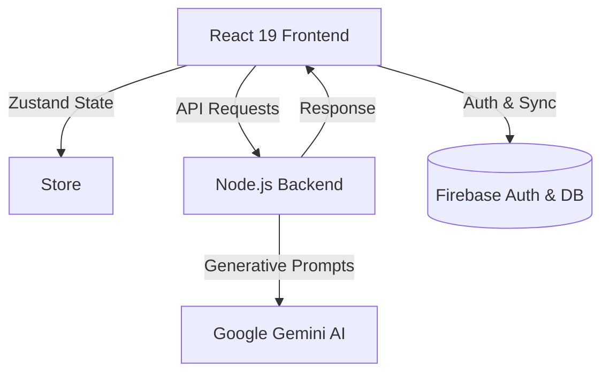

<div align="center">


# ✦ Velora AI ✦

<h3 align="center">
  The Future of E-Commerce is Conversational
</h3>

<p align="center">
  <strong>Intelligent Shopping • Multimodal Vision • Personalized Choices</strong>
</p>

<p align="center">
  <a href="#-core-features">Features</a> •
  <a href="https://velora-ai.vercel.app/">Live Demo</a> •
  <a href="#-architecture">Architecture</a> •
  <a href="#-quick-start-run-locally">Quick Start</a>
</p>

<div align="center">
  
  [](https://react.dev)
  [](https://vitejs.dev)
  [](https://tailwindcss.com)
  [](https://aistudio.google.com/)
  
</div>

---

</div>

<br/>

## 🌌 The Vision

Traditional online shopping is broken. You spend hours reading fake reviews, comparing meaningless specifications, and scrolling through endless pages of irrelevant products. 

**Velora AI** is a paradigm shift. We’ve built an ultra-premium, AI-native shopping consultant that acts as your personal concierge. You don't search; you *converse*. Powered by Google's state-of-the-art **Gemini 1.5** models, Velora parses your exact intent, budget, and aesthetic preferences to curate the perfect products instantly.

<br/>

## ✨ Core Features

<details open>
<summary><b>💬 Conversational AI Concierge</b></summary>
<br/>
Forget keyword searches. Just type exactly what you want: 
<br/><br/>
<kbd> "Find me a great espresso machine under $500 for a beginner, but it needs to look good in a minimalist kitchen."</kbd>
<br/><br/>
Velora understands the context and instantly builds a customized UI carousel of perfect matches.
</details>

<details open>
<summary><b>👁️ Multimodal Visual Search</b></summary>
<br/>
See a gadget you like on social media? Just upload a screenshot. Velora uses advanced multimodal vision to analyze the image, identify the product, and recommend exactly what you're looking for.
</details>

<details open>
<summary><b>⚖️ Intelligent Comparison Matrix</b></summary>
<br/>
Select multiple products and let Velora do the heavy lifting. Our AI dynamically generates:
<ul>
  <li>🏆 <b>Categorized Verdicts:</b> (Best Overall, Best Budget)</li>
  <li>✅ <b>Pros & Cons:</b> Synthesized from thousands of data points.</li>
  <li>📊 <b>Grouped Specifications:</b> Tech specs elegantly categorized for easy reading.</li>
</ul>
</details>

<br/>

## 🎨 Ultra-Premium UI/UX

Velora AI is designed to look and feel like a luxury digital experience:
* **Glassmorphism & Neon Highlights:** Deep dark mode with vibrant, context-aware glowing accents.
* **Framer Motion Micro-interactions:** Every button press and page transition is governed by smooth spring physics.
* **Component-Driven Design:** A highly modular, easily scalable React architecture.

---

## 🏗️ Architecture

Velora uses a modern, lightweight, but immensely powerful tech stack:



---

## 🚀 Quick Start (Run Locally)

Get your own personal AI shopper running in less than 2 minutes.

### 1. Prerequisites
* **Node.js** (v18+)
* **Google Gemini API Key** ([Get it for free here](https://aistudio.google.com/))

### 2. Setup

```bash
# Clone the repository
git clone https://github.com/kanith8206/Velora-ai.git

# Navigate to directory
cd velora-ai

# Install dependencies
npm install
```

### 3. Environment Variables
Create a `.env` file in the root folder and add your key:
```env
GEMINI_API_KEY=your_gemini_key_here
```

### 4. Ignite 🔥
```bash
npm run dev
```
Open **`http://localhost:3000`** in your browser and start chatting!

---

<div align="center">
  <br/>
  <i>Crafted with passion for the future of e-commerce.</i>
  <br/><br/>
  <b>If you found this project inspiring, please consider leaving a ⭐️</b>
</div>
